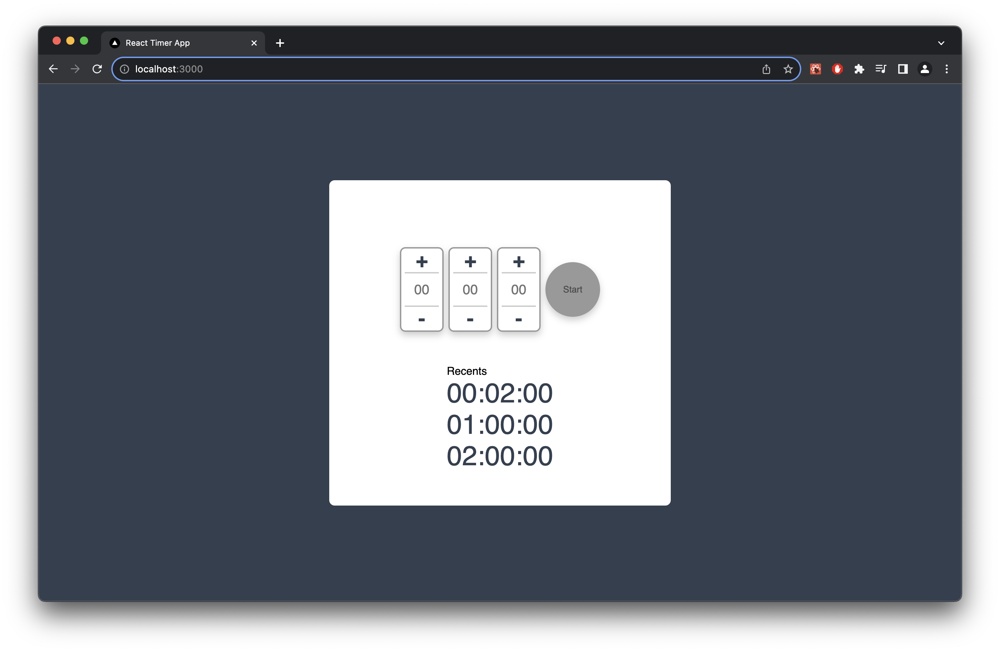
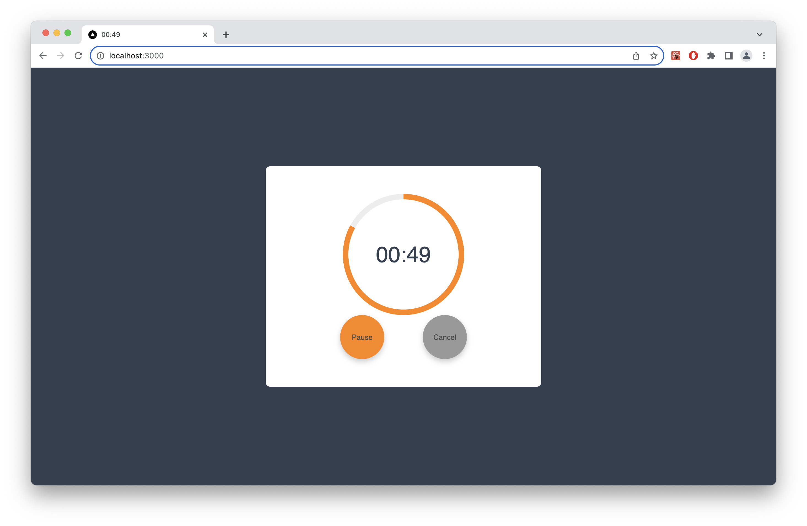

# web timer

[Demp](https://zi-shane.github.io/web-timer)

A simple react timer applicaion.

## Features

- Timer can set range from 00:00:01 to 23:59:59.
- Recently 3 timer can be quick start.
- Pause and Resume timer.
- Show timer at tab title.
- **Warning toast manager.** (ToastPortal, Toast)
  - `createPortal()` as a toast management dependency.
  - `useForwardRef()` and `useImperativeHandle()` call API to show taost.
  - `useEffect()` to control auto-remove every 3 seconds.

## Getting Started

First, run the development server:

```bash
npm run dev
```

Open [http://localhost:3000](http://localhost:3000) with your browser to see the result.

## Snapshot




## CSS template (tmpl/)

- Circle Process Bar
- Number Setter
- Toast
