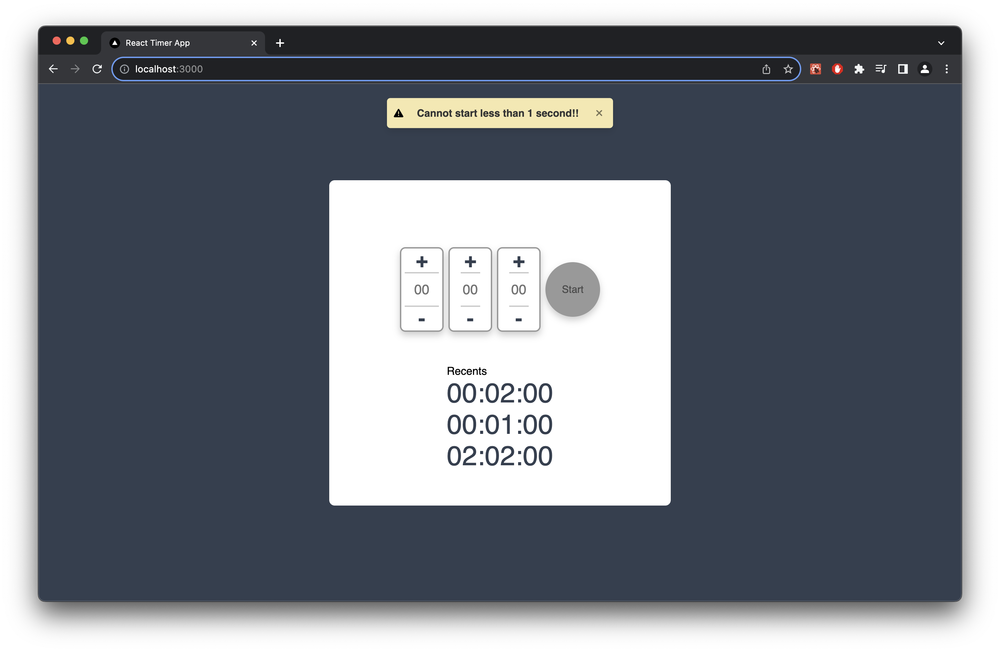

## Getting Started

First, run the development server:

```bash
npm run dev
```

Open [http://localhost:3000](http://localhost:3000) with your browser to see the result.

You can start editing the page by modifying `app/page.tsx`. The page auto-updates as you edit the file.

This project uses [`next/font`](https://nextjs.org/docs/basic-features/font-optimization) to automatically optimize and load Inter, a custom Google Font.


## Snapshot




## Features

- Timer can set range from 00:00:01 to 23:59:59.
- Recently 3 timer can be quick start.
- Pause and Resume timer.
- Show timer at tab title.
- Start 00:00:00 will show warning toast.
